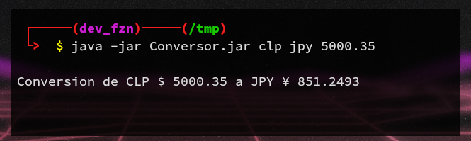
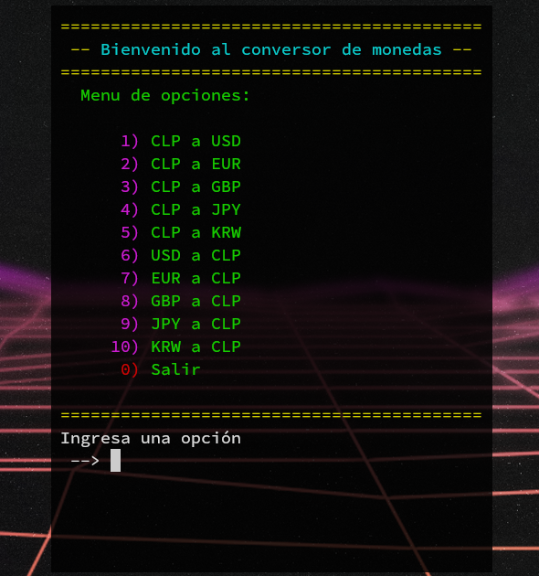
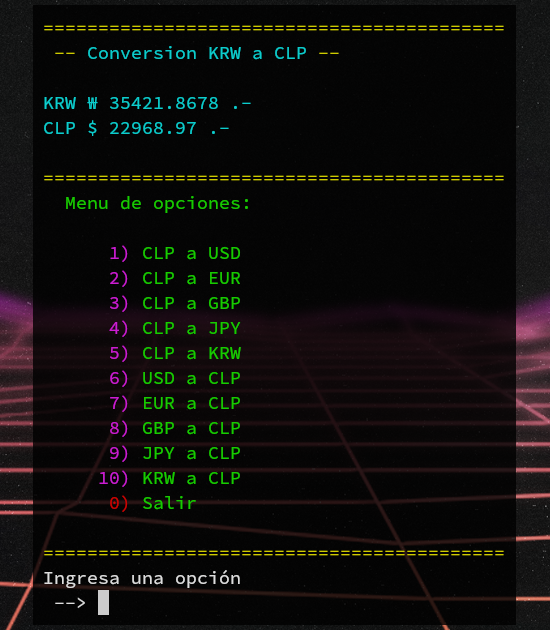

# Challenge Conversor


## Primer Challenge Java

Se solicita crear un conversor de divisas utilizando el lenguaje Java

### Requerimientos

- El convertidor de moneda debe:
  - Convertir de la moneda de tu país a Dólar
  - Convertir de la moneda de tu país  a Euros
  - Convertir de la moneda de tu país  a Libras Esterlinas
  - Convertir de la moneda de tu país  a Yen Japonés
  - Convertir de la moneda de tu país  a Won sul-coreano
  - Convertir de Dólar a la moneda de tu país
  - Convertir de Euros a la moneda de tu país
  - Convertir de Libras Esterlinas a la moneda de tu país
  - Convertir de Yen Japonés a la moneda de tu país
  - Convertir de Won sul-coreano a la moneda de tu país

> **Extra:**
Añadir otros tipos de conversiones, ejm. temperatura

### Recursos

<details><summary markdown="span">Detalles</summary>

- Tablero [Trello](https://trello.com/b/ss84DsE3/g5-challenge-conversor)
- Alura Blog - java.[swing](https://www.aluracursos.com/blog/biblioteca-swing)
- Alura Blog - Eclipse
[WindowBuilder](https://www.aluracursos.com/blog/interfaces-graficas-con-eclipse-windowbuilder)
- Alura YouTube - [enums](https://www.youtube.com/watch?v=EoPvlE85XAQ)

</details>

### Proyecto

- [ ] Releases
- [ ] [Conversor](./target/Conversor.jar).jar en desarrollo
- [ ] Imagenes
   - [x] Version CLI
   - [x] Version TUI
   - [ ] Version GUI
- [ ] Video
- [ ] [Javadocs](https://devfzn.github.io/Desafio_Conversor/overview-tree.html)

## Conversor de Monedas CLI

[](./media/conv_cli_ayuda.png)
[](./media/conv_cli_ejm.png)

## Conversor de Monedas TUI

[](./media/conv_tui_menu.png)
[](./media/conv_tui_ejm.png)

## Conversor de monedas GUI

<!--
[comment]: # ([](./media/conv_gui_menu.png))
[comment]: <> ([](./media/conv_gui_ejm.png))
-->

----

#### Requerimientos

- Jar
  - Java JRE 17 o superior
- Source
  - Java JDK 17 o superior
  - Eclipse IDE 2023-06 (4.28.0) o superior

#### Instrucciones

- **Correr applicacion desde el IDE**

  Desde archivo `Conversor.java` del package `cl.conversor.app`

- **Correr `Conversor.jar`**

  ```sh
  # GUI
  java -jar Conversor.jar

  # TUI
  java -jar Conversor.jar TUI

  # CLI
  java -jar Conversor.jar USD EUR 1234.5678
  java -jar Conversor.jar ayuda
  ```
