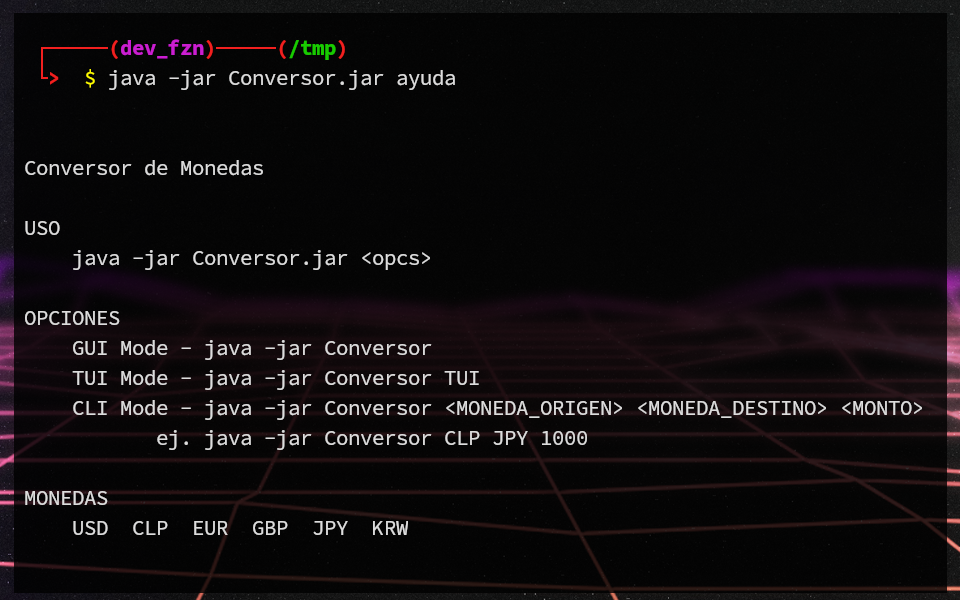

# Challenge Conversor


## Primer Challenge Java

Se solicita crear un conversor de divisas utilizando el lenguaje Java


<details>
<summary><b><font size="+2">Requerimientos de la aplicación</font></b></summary>

- [x] El convertidor de moneda debe:
  - [x] Convertir de la moneda de tu país a Dolar
  - [x] Convertir de la moneda de tu país a Euros
  - [x] Convertir de la moneda de tu país a Libras Esterlinas
  - [x] Convertir de la moneda de tu país a Yen Japonés
  - [x] Convertir de la moneda de tu país a Won sul-coreano
  - [x] Convertir de Dolar a la moneda de tu país
  - [x] Convertir de Euros a la moneda de tu país
  - [x] Convertir de Libras Esterlinas a la moneda de tu país
  - [x] Convertir de Yen Japonés a la moneda de tu país
  - [x] Convertir de Won sul-coreano a la moneda de tu país
- [ ] **Extra:** Añadir otros tipos de conversiones, ejm. temperatura
- [ ] **Menu princiapl**. Cuadro de dialogo debe permitir al usuario escoger entre
las opciones de conversión, según los requisitos solo es necesario hacer un
conversor de moneda pero en caso que desees implementar otras funciones en la
foto anexada podemos ver una opción de menú con otras funciones.
  - [ ] Utilice la clase **JOptionPane** de la biblioteca Javax
  - [ ] Utilice el método **showInputDialog** como un objeto para presentar más de
  una opción
- [x] **Opciones de monedas**. Cuadro de dialogo debe permitir al usuario escoger
entre las diferentes monedas a la que desea convertir su dinero.
  - [x] Utilice la clase **JOptionPane** de la biblioteca Javax
  - [x] Utilice el método **showInputDialog** como un objeto para presentar
  más de una opción para la conversión
- [ ] El **cuadro de dialogo para entrada de usuario** debe permitir al usuario
ingresar el valor o la cantidad de dinero que desea convertir a la moneda escogida
anteriormente, por ejemplo: el usuario ingresará la cantidad de Pesos Colombianos
que quiere convertir a Dólares.  
Este input debe estar validado y no debe aceptar otro tipo de caracteres que no
sean del tipo numéricos.  
Utilice el método **showInputDialog** para que el usuario inserte un valor.
- [ ] Si el usuario introduce letras o caracteres especiales y presiona ok **debe
ser mostrado un mensaje apuntando que el valor no es válido**.  
Utilice el método **showMessageDialog** para validar la entrada para que no se
acepten caracteres no numéricos.
- [ ] Mostrar al usuario el valor de la conversión realizada.
  - [ ] Utilice el método **showMessageDialog** para mostrar el valor de la conversión.
- [ ] Utilice el método **showConfirmDialog** para preguntar al usuario si desea
continuar usando el programa presentando las siguientes opciones:
  - [ ] **Yes**: Debe llevar nuevamente a nuestro usuario a menu principal para
  escoger una opción de conversión
  - [ ] **No**: Debe mostrar un mensaje de "Programa Finalizado"
  - [ ] **Cancel**: Debe mostrar un mensaje de "Programa Finalizado"
- [ ] Si el usuario selecciona la opción **No** o **Cancel** utilice
**showMessageDialog** para que pueda cerrar el programa. con el mensaje
***"Programa Terminado"***
- [ ] **Extra**: Después de que el usuario haga clic en continuar en el programa,
presente el cuadro de opciones de conversión para que pueda verificar otro valor
en una moneda diferente.  
Realiza más de un programa de conversión, además de moneda, puede ser
temperatura, distancia, velocidad, entre otros.

</details>

</br>

<details>
<summary><b><font size="+2">Recursos</font></b></summary>

- Tablero [Trello](https://trello.com/b/ss84DsE3/g5-challenge-conversor)
- Alura Blog - java.[swing](https://www.aluracursos.com/blog/biblioteca-swing)
- Alura Blog - Eclipse
[WindowBuilder](https://www.aluracursos.com/blog/interfaces-graficas-con-eclipse-windowbuilder)
- Alura YouTube - [enums](https://www.youtube.com/watch?v=EoPvlE85XAQ)
- [JOptionPane](https://docs.oracle.com/en/java/javase/17/docs/api/java.desktop/javax/swing/JOptionPane.html)
Doc

</details>

### Proyecto

- [ ] Releases
- [ ] [Conversor](./target/Conversor.jar).jar en desarrollo
- [ ] Imagenes
   - [x] Version CLI
   - [x] Version TUI
   - [ ] Version GUI
- [ ] Video
- [ ] [Javadocs](https://devfzn.github.io/Desafio_Conversor/overview-tree.html)

## Conversor de Monedas CLI

[](./media/conv_cli_ayuda.png)
[](./media/conv_cli_ejm.png)

## Conversor de Monedas TUI

[](./media/conv_tui_menu.png)
[](./media/conv_tui_ejm.png)

## Conversor de monedas GUI

<!--
[comment]: # ([](./media/conv_gui_menu.png))
[comment]: <> ([](./media/conv_gui_ejm.png))
-->

----

#### Requerimientos para correr el proyecto

- **Jar**
  - Java JRE 17 o superior
- **Source**
  - Java JDK 17 o superior
  - Eclipse IDE 2023-06 (4.28.0) o superior

#### Instrucciones

- Para correr applicacion desde el **IDE**

  Desde archivo `Conversor.java` del package `cl.conversor.app`

- Para correr el **Conversor.jar**

  ```sh
  # GUI
  java -jar Conversor.jar

  # TUI
  java -jar Conversor.jar TUI

  # CLI
  java -jar Conversor.jar USD EUR 1234.5678
  java -jar Conversor.jar ayuda
  ```
